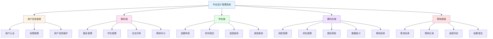

# 毕业设计管理系统 - 模块结构图

## 模块结构图

## 模块说明

| 模块 | 负责人 | 主要功能 |
|------|--------|----------|
| 用户信息管理 | @woshiluo | 用户认证、权限管理、用户信息维护 |
| 教师端 | @CSharperMantle | 题目管理、学生管理、论文评审、答辩评分 |
| 学生端 | @Renxiejing | 选题申请、材料提交、进度查询、成绩查询 |
| 教科办端 | @woshiluo | 流程管理、师生管理、题目审核、数据统计、答辩安排 |
| 答辩组端 | @cbhuo123456-create | 答辩名单、答辩记录、成绩评定、结果提交 |
