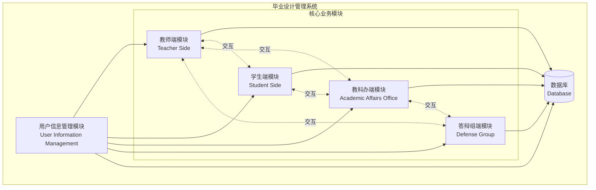
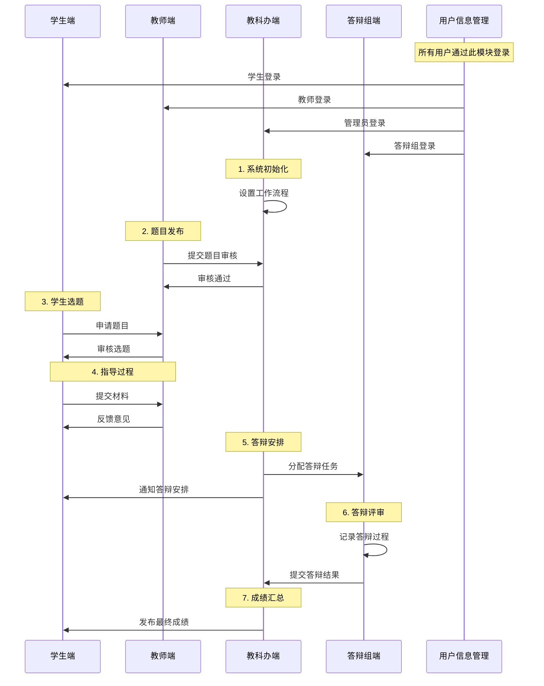
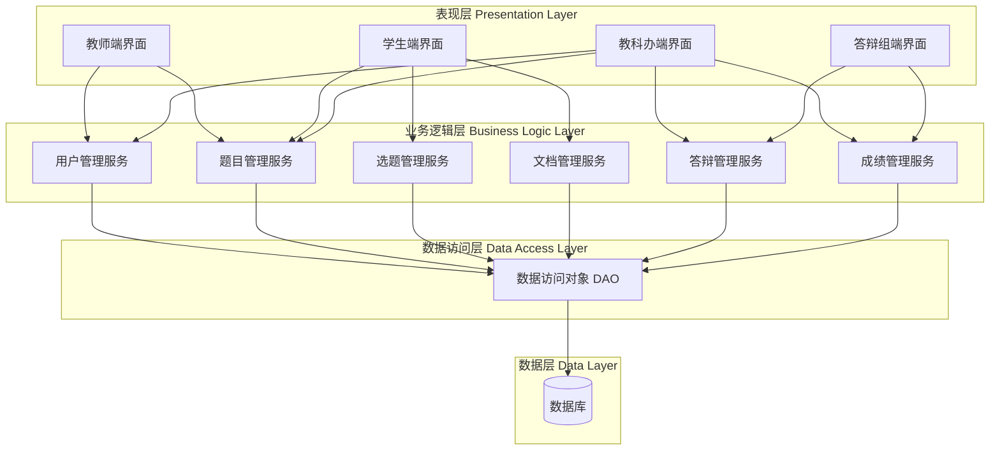

# 毕业设计管理系统 - 模块结构图

## 系统概述

高校毕业设计管理系统是一个面向高校师生及管理人员的综合性平台，旨在实现毕业设计全流程的数字化管理。系统采用模块化设计，各模块相互协作，共同完成毕业设计从选题、指导、评审到答辩的全过程管理。

## 系统架构图

## 模块详细说明

### 1. 用户信息管理模块 (User Information Management)

**负责人**: @woshiluo

**主要功能**:
- 用户身份认证与授权
- 用户信息维护（教师、学生、管理员等）
- 角色权限管理
- 用户档案管理
- 统一登录入口

**核心职责**:
- 为其他所有模块提供统一的用户身份验证服务
- 管理用户基本信息和权限配置
- 确保系统安全性和数据访问控制

### 2. 教师端模块 (Teacher Side)

**负责人**: @CSharperMantle

**主要功能**:
- 发布毕业设计题目
- 查看学生选题情况
- 审核学生选题申请
- 指导学生毕业设计
- 查看并评审学生提交的材料
- 评阅学生论文
- 参与答辩评分

**核心职责**:
- 提供教师指导毕业设计的全流程支持
- 管理题目库和学生分配
- 完成论文评阅和成绩评定

### 3. 学生端模块 (Student Side)

**负责人**: @Renxiejing

**主要功能**:
- 浏览可选毕业设计题目
- 申请选题
- 提交开题报告
- 上传论文及相关材料
- 查看指导教师反馈
- 查看答辩安排
- 查询成绩

**核心职责**:
- 为学生提供毕业设计全流程操作界面
- 管理学生提交的各类文档和材料
- 展示进度和评审结果

### 4. 教科办端模块 (Academic Affairs Office)

**负责人**: @woshiluo

**主要功能**:
- 设置毕业设计工作流程和时间节点
- 管理师生信息
- 监控毕业设计进度
- 审核题目库
- 生成统计报表
- 发布系统通知
- 管理答辩安排

**核心职责**:
- 提供教学管理部门的行政管理功能
- 监督和协调整个毕业设计流程
- 生成各类统计和分析报告

### 5. 答辩组端模块 (Defense Group)

**负责人**: @cbhuo123456-create

**主要功能**:
- 查看答辩学生名单
- 安排答辩时间和地点
- 记录答辩过程
- 评定答辩成绩
- 生成答辩记录
- 提交答辩结果

**核心职责**:
- 管理答辩环节的全部流程
- 记录和评定答辩表现
- 生成答辩相关文档

## 模块交互关系

### 主要交互流程

### 数据流向

1. **用户信息管理 → 各模块**: 提供用户身份验证和权限信息
2. **教师端 ↔ 学生端**: 题目发布、选题申请、材料提交、反馈意见
3. **教师端 → 教科办端**: 题目提交审核、进度报告
4. **学生端 → 教科办端**: 流程监控、数据统计
5. **教科办端 → 答辩组端**: 答辩任务分配、学生信息
6. **答辩组端 → 教科办端**: 答辩结果、成绩提交

## 技术架构

### 系统分层

## 开发分工

| 模块 | 负责人 | 主要任务 |
|------|--------|----------|
| 用户信息管理 | @woshiluo | 用户认证、权限管理、用户信息维护 |
| 教师端 | @CSharperMantle | 题目管理、学生指导、论文评审 |
| 学生端 | @Renxiejing | 选题申请、材料提交、进度查询 |
| 教科办端 | @woshiluo | 流程管理、数据统计、系统配置 |
| 答辩组端 | @cbhuo123456-create | 答辩安排、成绩评定、记录管理 |

## 关键功能点

### 权限控制
- 基于角色的访问控制 (RBAC)
- 不同角色具有不同的操作权限
- 用户信息管理模块统一管理所有权限

### 工作流管理
- 支持自定义工作流程
- 时间节点控制
- 状态跟踪

### 数据安全
- 用户密码加密存储
- 数据传输加密
- 操作日志记录
- 数据备份机制

### 消息通知
- 系统内消息通知
- 邮件通知（可选）
- 重要节点提醒

## 扩展性考虑

系统设计采用模块化架构，便于后续扩展：
- 可添加新的业务模块
- 支持与其他系统集成
- 可扩展至移动端应用
- 支持第三方认证系统接入

## 版本信息

- 文档版本: v1.0
- 创建日期: 2025-12-04
- 最后更新: 2025-12-04
